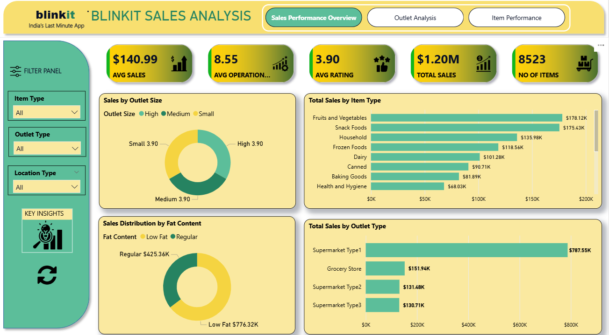

# 🚀 Blinkit Sales Dashboard — Power BI Project

---

## 📘 Project Overview
An interactive **Power BI dashboard** analyzing **Blinkit’s grocery sales performance, outlet operations, and customer satisfaction**.  
It combines strong **data modeling**, **DAX-based KPIs**, and **visual storytelling** to support decision-making in India’s fast-growing quick-commerce sector.

---

## 📊 Key Metrics
| Metric | Value |
|--------|--------|
| **Total Sales** | **$1.20M** |
| **Avg Sales per Outlet** | **$140.99** |
| **Avg Rating (CSAT)** | **3.90** |
| **Avg Years of Operation** | **8.55** |
| **Total Items** | **8,523** |

---

## 🧠 Core Analysis Highlights
- **Top Categories:** Fruits & Vegetables and Snack Foods lead in revenue (>₹175K each).  
- **Outlet Performance:** Supermarket Type 1 dominates with ₹787.55K in sales.  
- **Fat Content Impact:** Low Fat products outperform Regular (₹776.32K vs ₹425.36K).  
- **Tier Performance:** Tier 3 outlets contribute the highest total sales (₹472.13K).  
- **CSAT:** Average rating stable at 3.9 across all outlet sizes.

---

## 🧩 Data Modeling & Measures
- **Data Model:** Star schema with one fact table and multiple dimension tables (Items, Nutrition, Outlets, Locations).  
- **Calculated Columns Created:**
  - `Sales per Kg`  
  - `Years of Operation`  
- **DAX Measures Developed:**
  - Total Sales  
  - Average Sales per Outlet  
  - Average Rating (CSAT)  
  - Sales by Tier / Outlet Type / Fat Content  
  - Sales per Kg  
  - Item Visibility Impact  
  - Top 10 Items by Sales and Rating  

These measures power the dashboard’s KPIs and visual comparisons.

---

## 📂 Repository Structure
├── data/
│ └── blinkit_grocery.csv
├── powerbi/
│ └── Blinkit_Sales_Report.pbix
├── docs/
│ └── BLINKIT_SALES_DASHBOARD.pdf
├── images/
│ └── data_model.png
└── BUSINESS_INSIGHTS.md

---

## ⚙️ How to Use
1. Open `Blinkit_Sales_Report.pbix` in **Power BI Desktop**.  
2. Load data from `data/blinkit_grocery.csv`.  
3. Refresh all queries → verify calculated columns and DAX measures.  
4. Interact with slicers for **Item Type**, **Outlet Type**, **Tier**, and **Fat Content**.  
5. Explore visuals: *Sales Overview*, *Outlet Analysis*, *Item Performance*.

---

## 🧾 Dashboard Preview
*(from the Power BI report)*  

---

## 💬 Summary
This Power BI dashboard demonstrates **end-to-end analytics** — from data cleaning and modeling to KPI visualization and storytelling.  
By combining **calculated columns**, **custom DAX measures**, and **interactive visuals**, the project provides actionable insights into Blinkit’s product strategy, outlet efficiency, and customer behavior.